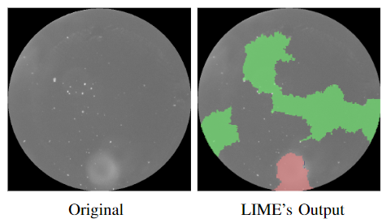
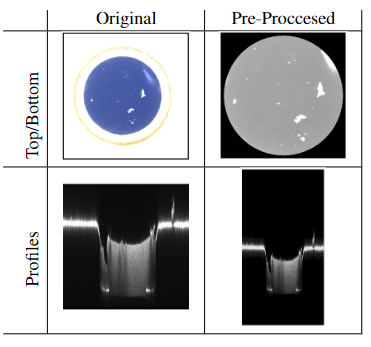

# Determining HEDP Foams' Quality with Multi-View Deep Learning Classification


# Introduction
High energy density physics (HEDP) experiments commonly involve a dynamic wave-front propagating inside a low-density foam. This effect affects its density and hence, its transparency. A common problem in foam production is the creation of defective foams. Accurate information on their dimension and homogeneity is required to classify the foams' quality. Therefore, those parameters are being characterized using a 3D-measuring laser confocal microscope. For each foam, five images are taken: two 2D images representing the top and bottom surface foam planes and three images of side cross-sections from 3D scannings. An expert has to do the complicated, harsh, and exhausting work of manually classifying the foam's quality through the image set and only then determine whether the foam can be used in experiments or not. Currently, quality has two binary levels of normal vs. defective. At the same time, experts are commonly required to classify a sub-class of normal-defective, i.e., foams that are defective but might be sufficient for the needed experiment. This sub-class is problematic due to inconclusive judgment that is primarily intuitive. In this work, we present a novel state-of-the-art multi-view deep learning classification model that mimics the physicist's perspective by automatically determining the foams' quality classification and thus aids the expert. Our model achieved 86\% accuracy on upper and lower surface foam planes and 82\% on the entire set, suggesting interesting heuristics to the problem. A significant added value in this work is the ability to regress the foam quality instead of binary deduction and even explain the decision visually. 
## Multi-View model Architecture  ##


# Instructions
## Requirments
First, clone the Multi-View-Foams code provided here.
```
clone https://github.com/Scientific-Computing-Lab-NRCN/Multi-View-Foams.git
```
You may use the file *MVFoamsENV* to create anaconda environment (python 3.7) with the required packages. To build the package run:
```
conda create --name <env_name> --file MVFoamsENV
```
Then, activate your environment:
```
conda activate <env_name>
```


# Citation
For more information about the measures and their means of the implementations, please refer to the paper.
If you found these codes useful for your research, please consider citing: 


## Running
### Configuration
1. Change the paths in config_paths.yml file to the relevant paths:
```
data_dir: /home/your_name/Desktop/Multi-View-Foams/data
full_groups_dir: /home/your_name/Desktop/Multi-View-Foams/data/full_groups
preprocess_dir: /home/your_name/Desktop/Multi-View-Foams/data/preprocess
models2_dir: /home/your_name/Desktop/Multi-View-Foams/model2/models
```

2. Change the path for openning the paths yml file in config.py to the relevant path:
```
with open(r'/home/your_name/Desktop/Multi-View-Foams/config_paths.yaml') as file:
```
  Verbosity variable is in config.py and output info according to the following levels:
  * verbosity 0 - no prints at all.
  * verbosity 1 - print only states and flow.
  * verbosity 2 - print lengths of arrays, and avove.
  * verbosity 3 - print included examples' names and above.

3. Running on GPU is necessary in order to load our models. Change the relevant paths and run the following to mark the relevant scripts as source-roots.
```
conda activate <env_name>
cd Desktop/Multi-View-Foams
export PYTHONPATH=$PYTHONPATH:$PWD
cd model2
export PYTHONPATH=$PYTHONPATH:$PWD
```

### Scripts
There are several scripts:
1. **data_extract.py** - the script for creating train and test sets. Creats the appropriate data according to the different parametrs (such as normal-defective including or not). Currently loads the pre-defined train to test split from the idxs_split.pkl file.
2. **pre_process.py** - pre-processing the input images.
3. **train.py** - the script for training the different models' configurations.
4. **evaluate.py** - generates AUC, ROC graph, loss and accuracy trends graphs for the models.
5. **lime_test.py** - generates LIME explaination for chosen images and a chosen model out of the one-view top, one-view bottom and one-view top-bottom models.


## Training
To train new models write your chosen models in model2/train.py script.
Examples_types are mapped as follows: One-view:  X10_0 (bottom), X10_1 (top), X10_both. Multi-view: X10, X20, all and in the following structure:
[['all']] for training with normal-defective and [['all', 'all']] for training both with and without normal-defective examples.
```
models = ['bottom', 'top', 'top_bottom', 'multi_top_bottom', 'multi_all', 'multi_profiles']
examples_types = [['X10_0', 'X10_0'], ['X10_1', 'X10_1'], ['X10_both', 'X10_both'], ['X10', 'X10'], ['all', 'all'], ['X20', 'X20']]
```

Next, choose the model's settings:
```
fc_in_features = 128  # 64 / 128 / 256
EPOCHS = 150
num_workers = 8
```
fc_in_feature is determinning the number of neurons in the fully connected last layer and cut convolutional layers from the Resnet architecture correspondingly.
You also need to turn on or off the right flags:
```
data_path = preprocess_dir  # directory of the data set after pre-process
full_data_use = True  # if false use 20 examples less in train set
augmentation = True  # augmentation such as brightnesss adjustments and gaussian noise
rotation = True  # rotation augmentation
```

## Evaluate
In order to evaluate a given models run the model2/evaluate.py script. You need to specify the chosen models the same as stated above in the training section but also choose the models directory (choosing the proper date).
The evaluation outputs accuracy, AUC, ROC graph, and loss and accuracy trends graphs graphs

## Model Explainability


Choosing the models you want to examine is similiar to the explaination above. You can choose one of the following models: one-view top, one-view bottom and one-view top-bottom. After entering a given directory, the script runs LIME on all the images in the path for all the specified models. You can also examine one image by turnning off the flag - multiple_imgs.

# Data
The data that was used for training in the paper can be found in:
  * Images: *data/preprocess*.
  * Labels: *data/image_labels.xlsx*.
* The raw data can be found in:
  * Batch 1: *data/full_groups*.
  * Batch 2: *data/full_groups_p1*.
  * Batch 3: *data/full_groups_p2*.


## Pre-Process


In order to pre-process the images fill the right source and save directories.
You can choose if you want to pre-preprocess only top and bottom views, only profiles or both.
Note that pre-processing the profiles in batch 2 and 3 isn't working due to inconsistency in the data images compare to the first batch (and thus a manual cut has been done and saved to the preprocess folder).

